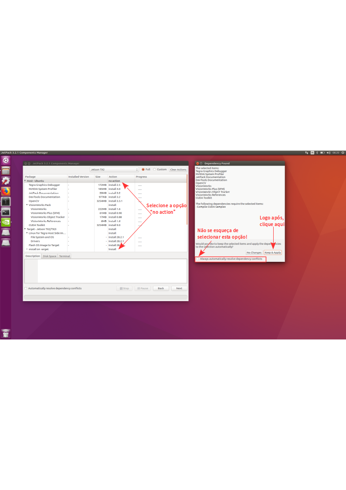
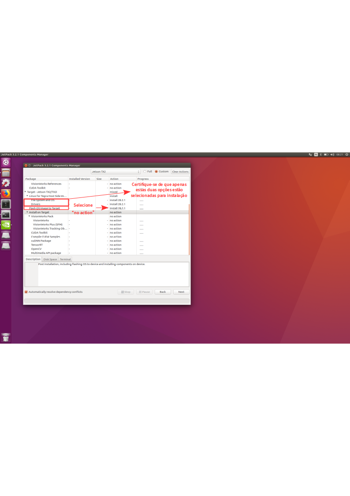
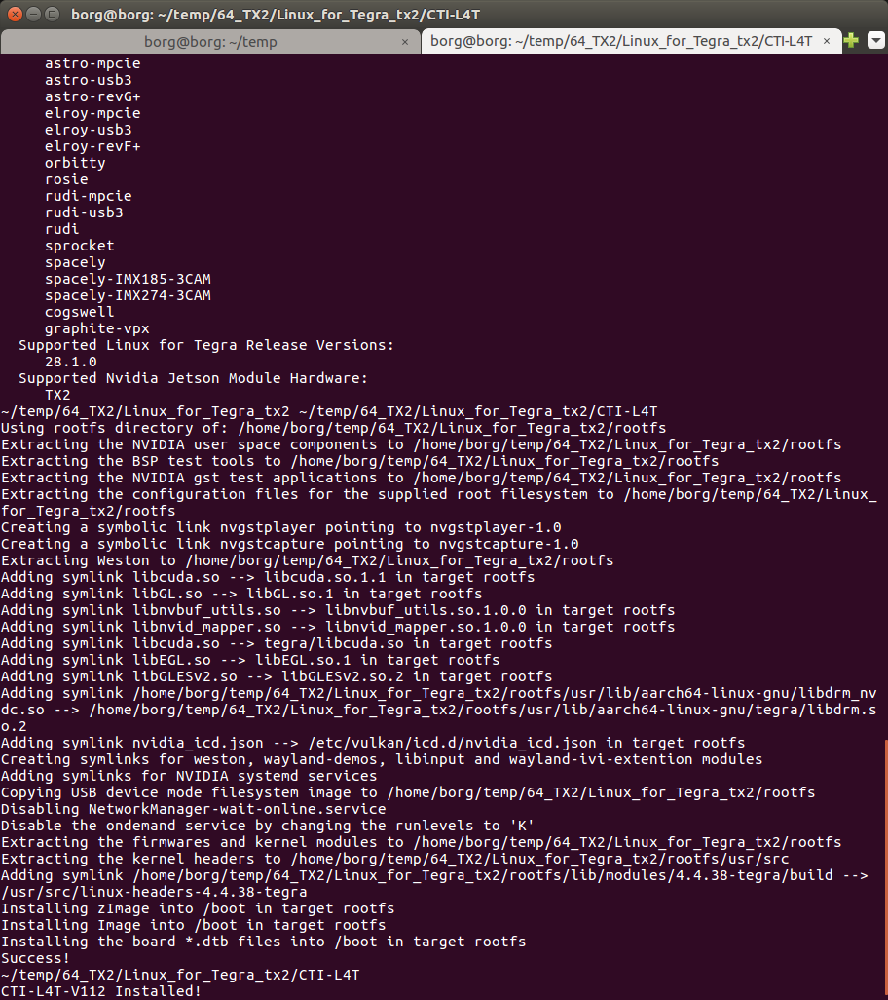
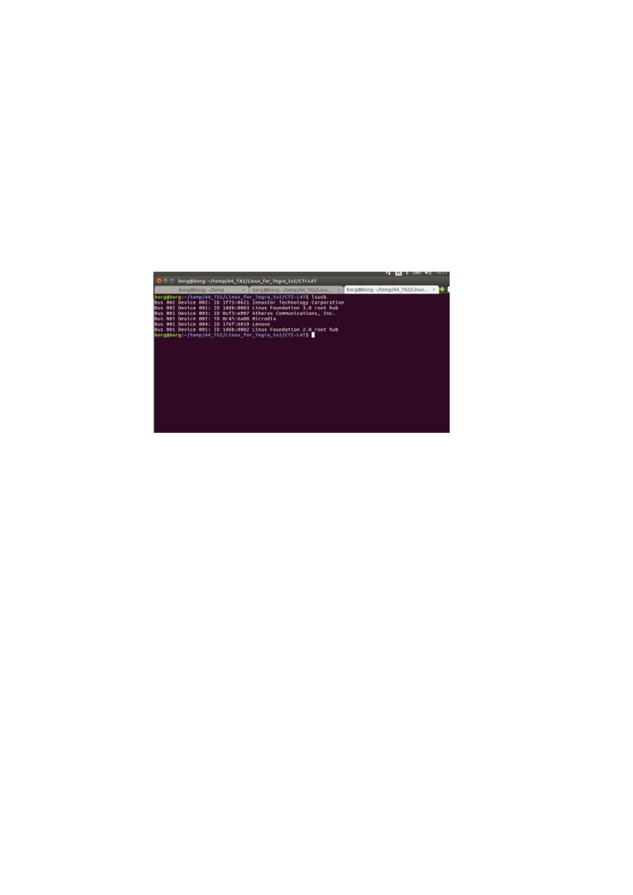
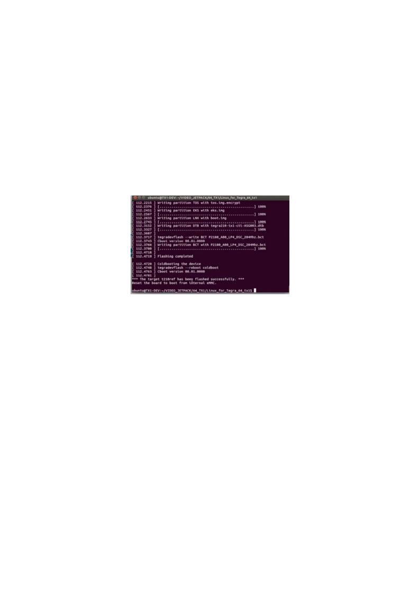

#  Carrier Board J120


Neste guia, faremos os setups iniciais no carrier board J120 com o módulo da Nvidia Jetson TX2.

#  O que é preciso?

- Um Host PC com Linux 16.04
- Fonte de alimentação 12V

# Configurando o Host PC 

- Em seu computador, rodando um Linux 16.04 faça o [download do JetPack 3.2.1](link/JetPack-L4T-3.2.1-linux-x64_b23.run)
- Abra o terminal e crie uma pasta no seu diretório
```
mkdir ~/temp 
```
- Mova o JetPack 3.2.1 para dentro da pasta criada

```
mv ~/Downloads/JetPack-L4T-3.2.1-linux-x64_b23.run  ~/temp

```
- Garanta que o JetPack tem permissão para executar 

```
 chmod +x JetPack-L4T-3.2.1-linux-x64_b23.run 

```

- Execute o JetPack 3.2.1

```
./JetPack-L4T-3.2.1-linux-x64_b23.run 

```
 Clique em Next

 Configure corretamente o diretório para instalação

 Selecione a placa Jetson TX2

 Configure corretamente os pacotes que serão instalados na placa

 Configure corretamente os pacotes que serão instalados na placa

 Next para seguir a instalção

 Selecione Finish


Você pode fazer o Download do arquivo diretamente clicanto [aqui](link/CTI-L4T-V112.tgz), ou, acesse o [site](http://connecttech.com/support/resource-center/nvidia-jetson-tx2-tx1-product-support/) e siga os passos conforme a imagem...


- Copie o Arquivo baixado para o diretório Linux_for_Tegra_TX2 dentro da pasta 64_TX2 usando o comando a seguir;

```
cp ~/Downloads/CTI-L4T-V112.tgz ~/temp/64_TX2/Linux_for_Tegra_TX2

```

- Descompacte os arquivos com o comando;


```
cd ~/temp/64_TX2/Linux_for_Tegra_TX2/

tar -xvf CTI-L4T-V112.tgz

```

- Certifique-se de que o script tem permissão para instalar, em seguida, instale os pacotes...


```
cd ~/temp/64_TX2/Linux_for_Tegra_tx2/CTI-L4T

chmod a+x install.sh 

sudo ./install.sh

```

 Aguarde a instalção terminar
 

 Conecte os cabos de alimentação tomando cuidado com a polaridade


 Alimente a placa com 12 Volts


- Segure o botão Power, depois o Recovery, depois o Reset
- Solte o Power, depois o Recovery, depois o Reset para entrar em mode de programação




- Verifique se a placa está no modo de programação

```
lsusb

```

- Hora de gravar o firmawre na placa! 
Digite os comandos a seguir em um terminal;

```
cd ~/temp/64_TX2/Linux_for_Tegra_tx2

sudo ./flash.sh orbitty mmcblk0p1

```

- Aguarde o fim da gravação



## Tutorial adaptado com base no (Flashing NVIDIA Jetson TX2 or TX1 Module)[https://www.youtube.com/watch?v=9uMvXqhjxaQ] Feito por Jacob Wighton, Engineering Technical Support da Connect Tech Inc.


