#  Carrier Board J120

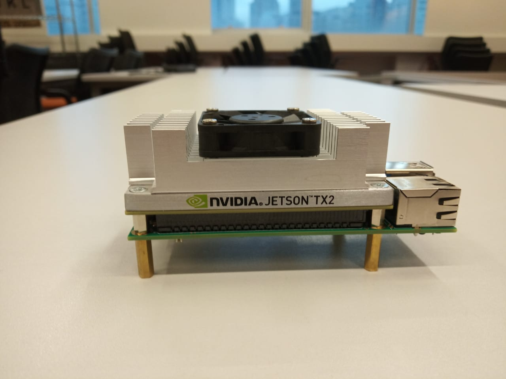

Neste guia, faremos os setups iniciais no carrier board J120 com o módulo da Nvidia Jetson TX2.

#  O que é preciso?

- Um Host PC com Linux 16.04
- Fonte de alimentação 12V
- Mouse/Teclado
- Monitor
- Roteador/Cabos de rede


# Configurando o Host PC 

- Conecte o seu Computador a uma rede local 
- Em seu computador, rodando um Linux 16.04 faça o [download do JetPack 3.2.1](https://developer.nvidia.com/embedded/jetpack-3_2_1)
- Abra o terminal e crie uma pasta no seu diretório
```
mkdir ~/j120
```
Mova o JetPack 3.2.1 para dentro da pasta criada

```
mv ~/Downloads/JetPack-L4T-3.2.1-linux-x64_b23.run  ~/j120

```
Garanta que o JetPack tem permissão para executar 

```
 chmod +x JetPack-L4T-3.2.1-linux-x64_b23.run 

```

Execute o JetPack 3.2.1

```
./JetPack-L4T-3.2.1-linux-x64_b23.run 

```

Clique em Next
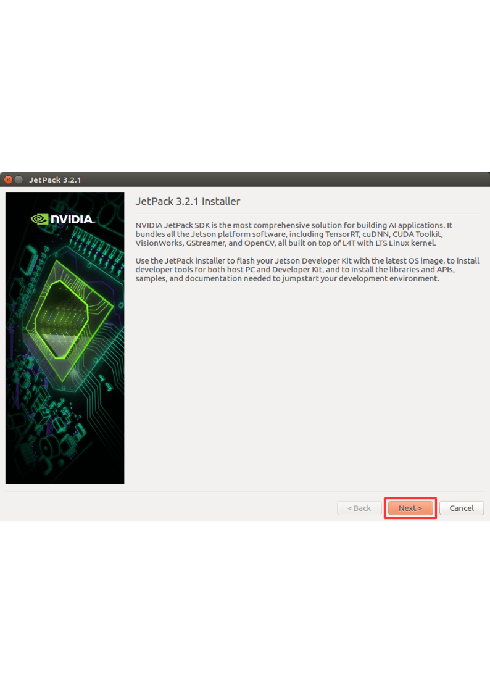 
Configure corretamente o diretório para instalação
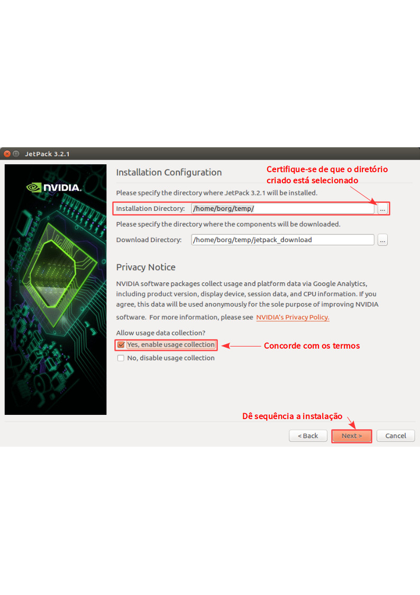 
Selecione a placa Jetson TX2
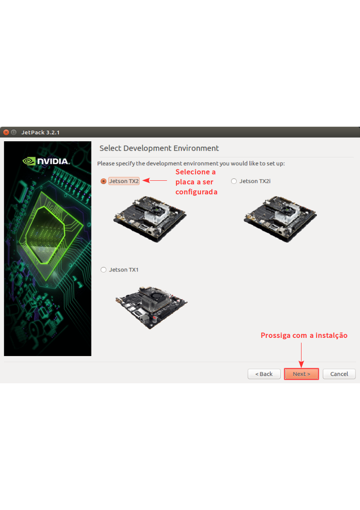 
Escolha aqui o que será instalado na sua J120
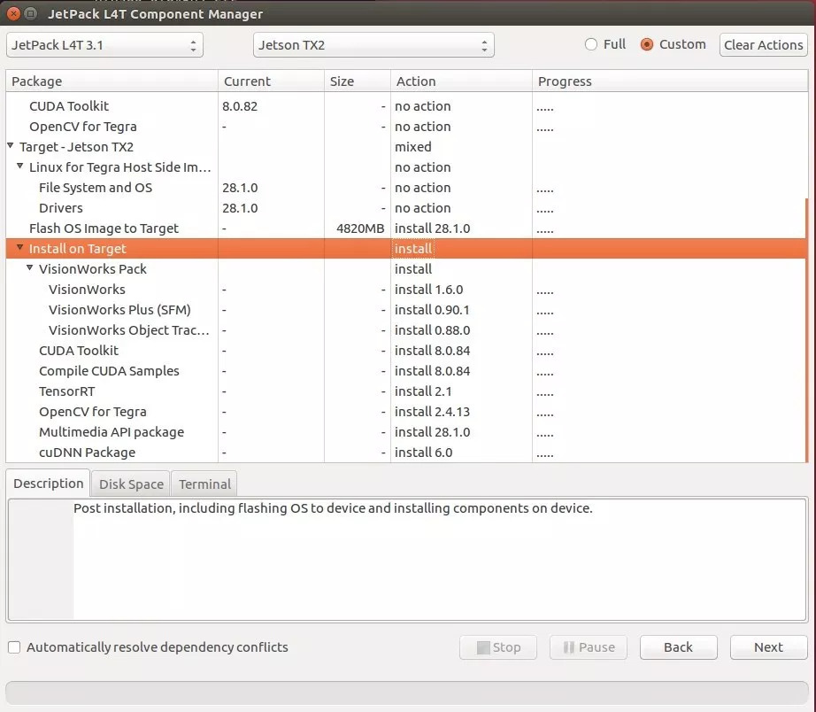 
Next para seguir a instalção
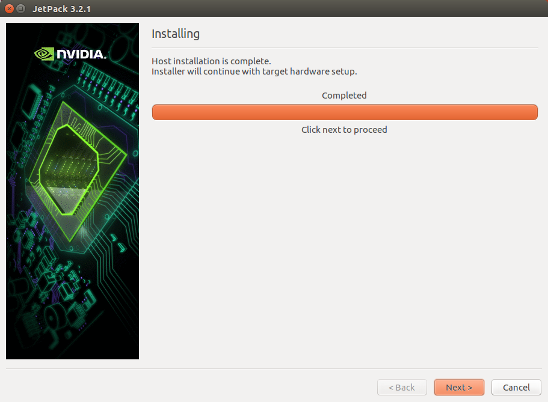 
Selecione Finish
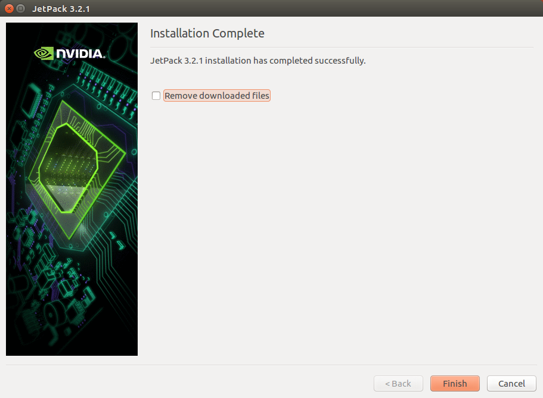 


# Agora vamos baixar o kernel e os patches da Auvidea J120-IMU v1.5

Você pode fazer o Download do arquivo com o comando a seguir para baixar pelo terminal 


```
cd ~/j120 
wget https://auvidea.com/download/firmware/TX2/v1.5/ChangesTX2J140_Kernel_r28.1_v1.5.tar.gz

```

Descompacte o arquivo 

```
tar zxvf ChangesTX2J140_Kernel_r28.1_v1.5.tar.gz

```

Copie o Arquivo baixado para o diretório Linux_for_Tegra_TX2 dentro da pasta 64_TX2 usando o comando a seguir;

```
cp ~/Downloads/CTI-L4T-V112.tgz ~/j120/64_TX2/Linux_for_Tegra_TX2

```

Descompacte os arquivos com o comando;


```
cd ~/j120/64_TX2/Linux_for_Tegra_TX2/

tar -xvf CTI-L4T-V112.tgz

```

Para o USB3.0 e 2.0 funcionar, subistitua esses arquivos com o comando;

```
cd ~/j120/ChangesTX2J140_Kernel_r28.1/BCT
cp -rf tegra186-mb1-bct-pmic-quill-p3310-1000-c01.cfg ~/j120/64_TX2/Linux_for_Tegra/bootloader/t186ref/BCT
cp -rf tegra186-mb1-bct-pmic-quill-p3310-1000-c02.cfg ~/j120/64_TX2/Linux_for_Tegra/bootloader/t186ref/BCT
cp -rf tegra186-mb1-bct-pmic-quill-p3310-1000-c03.cfg ~/j120/64_TX2/Linux_for_Tegra/bootloader/t186ref/BCT
cp -rf tegra186-mb1-bct-pmic-quill-p3310-1000-c04.cfg ~/j120/64_TX2/Linux_for_Tegra/bootloader/t186ref/BCT

```


Para validar as alterações no sistema

```
cd ~/j120/ChangesTX2J140_Kernel_r28.1/dtb
cp -rf tegra186-quill-p3310-1000-a00-00-base.dtb ~/j120/64_TX2/Linux_for_Tegra/kernel/dtb
cp -rf tegra186-quill-p3310-1000-c03-00-base.dtb ~/j120/64_TX2/Linux_for_Tegra/kernel/dtb
cp -rf tegra186-quill-p3310-1000-c03-00-dsi-hdmi-dp.dtb ~/j120/64_TX2/Linux_for_Tegra/kernel/dtb

```


Execute o JetPack novamente, certifique-se de que em "Flash OS Image to Target" na coluana action aparece "install 28.1.0".

```
./JetPack-L4T-3.2.1-linux-x64_b23.run 

```

 


# Vamos conlocar a J120 em modo de programção!

Hora de conectar um monitor a sua placa

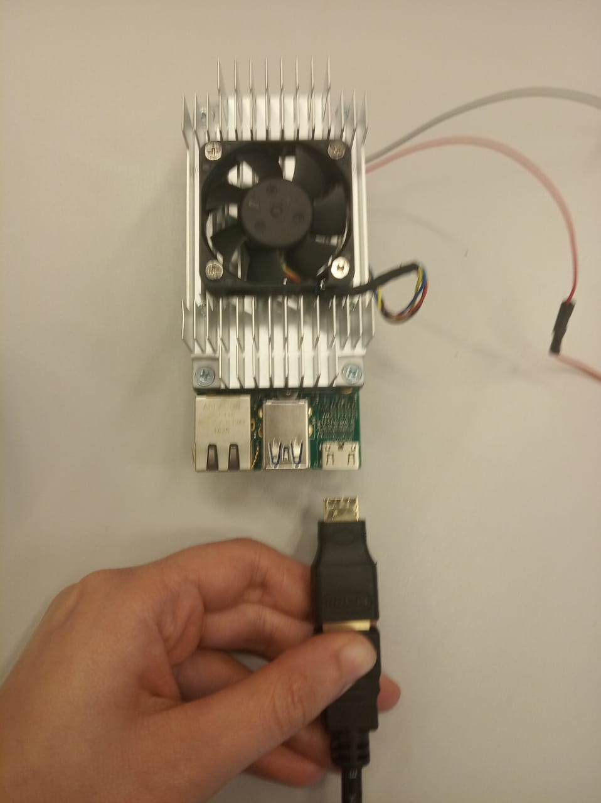

Conecte o J120 a mesma rede que o seu computador 

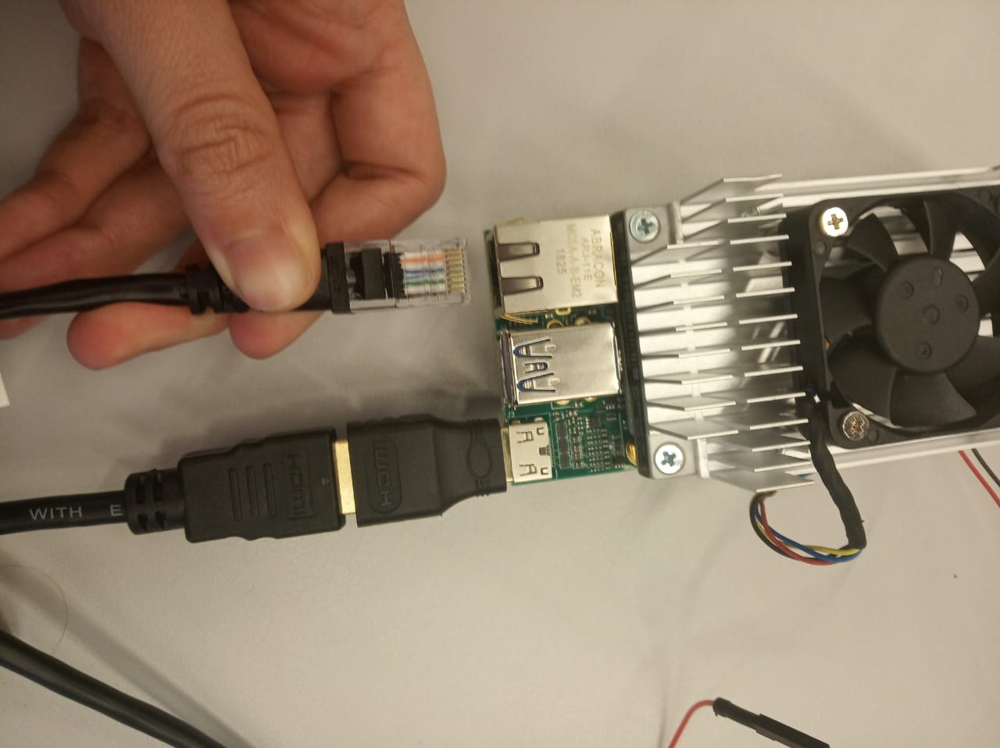

Conecte os cabos de alimentação tomando cuidado com a polaridade

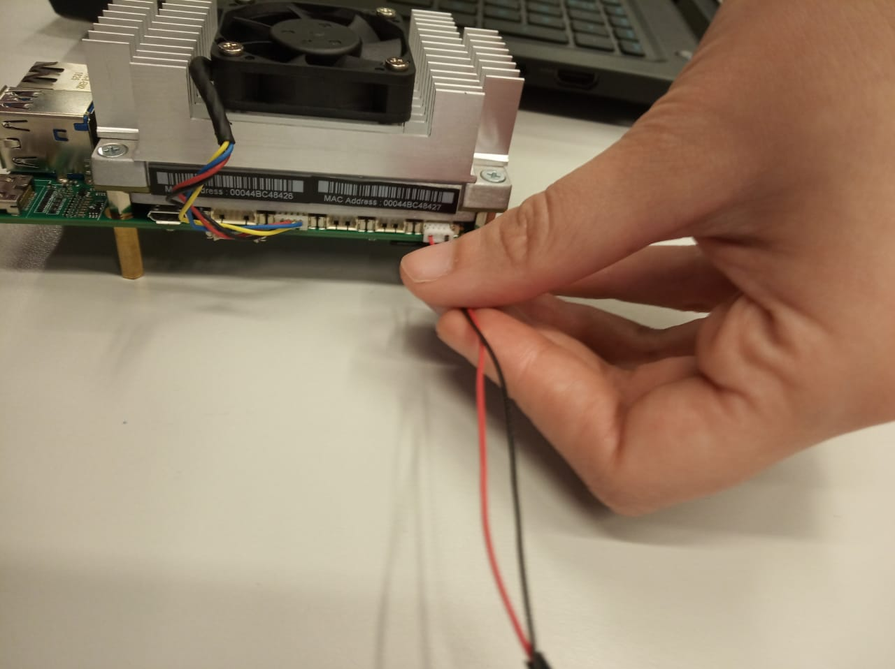 

 Alimente a placa com 12 Volts
 


Segure o botão Power, depois o Recovery, depois o Reset
Solte o Power, depois o Recovery, depois o Reset para entrar em mode de programação


Verifique se a placa está no modo de programação

```
lsusb

```

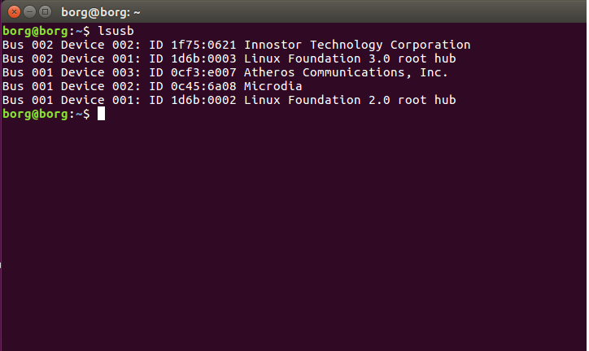


# Hora de gravar o firmawre na placa! 

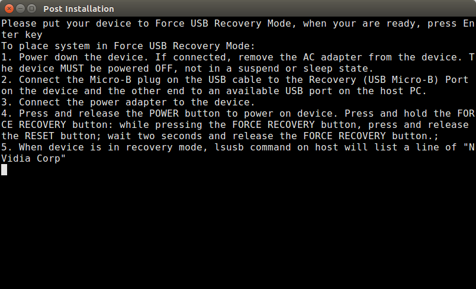 
- Dê Enter neste terminal quando a J120 estiver em modo de programação


Aguarde mais um pouco, a gravação ainda não terminou

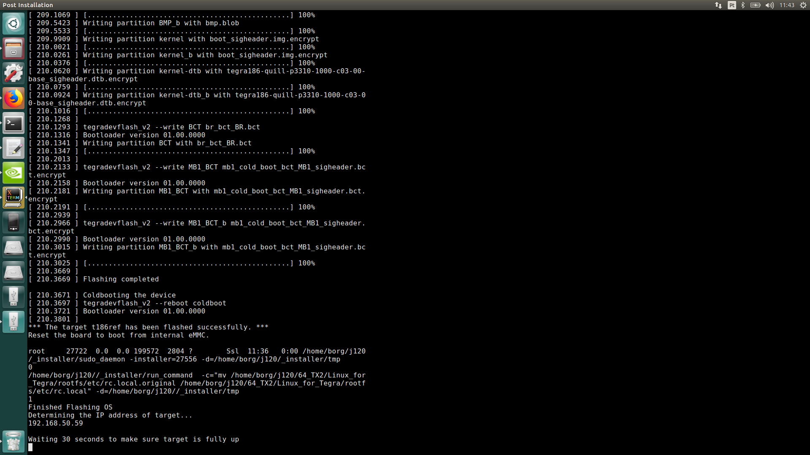

Enquanto o Host Pc faz a instalção dos pacotes via rede, vamos até a J120 fazer algumas configurações;

Abra o terminal e digite esses comandos para fazer uma copia dos seus arquivos de boot;

```
sudo cp -r /boot /boot_bkup
sudo cp -r /lib /lib_bkup
```

Faça o Download do pacote da Audivea J120-IMU

```
 cd ~/Downloads
wget https://auvidea.com/download/firmware/TX2/v1.5/ChangesTX2J140_Kernel_r28.1_v1.5.tar.gz
tar zxvf ChangesTX2J140_Kernel_r28.1_v1.5.tar.gz

```
Copie os arquivos para a pasta de boot;

```
cd ~/Downloads/ChangesTX2J140_Kernel_r28.1/kernel
sudo cp -rf Image /boot
sudo cp -rf zImage /boot
sudo cp -rf lib/* /lib

```

Aguarde o Host Pc terminar a instalação e reinicie o sistema para validar as configurações

[Fim da instalação](https://github.com/liciascl/insper-docs/blob/master/Informatica/Robotica/img/Screenshot%20from%202019-07-29%2017-34-37.png)

```
sudo reboot

```


## Tutorial baseado no [Setup J120-IMU for Jetson TX](https://shiroku.net/robotics/setup-j120-imu-for-jetson-tx2) 


