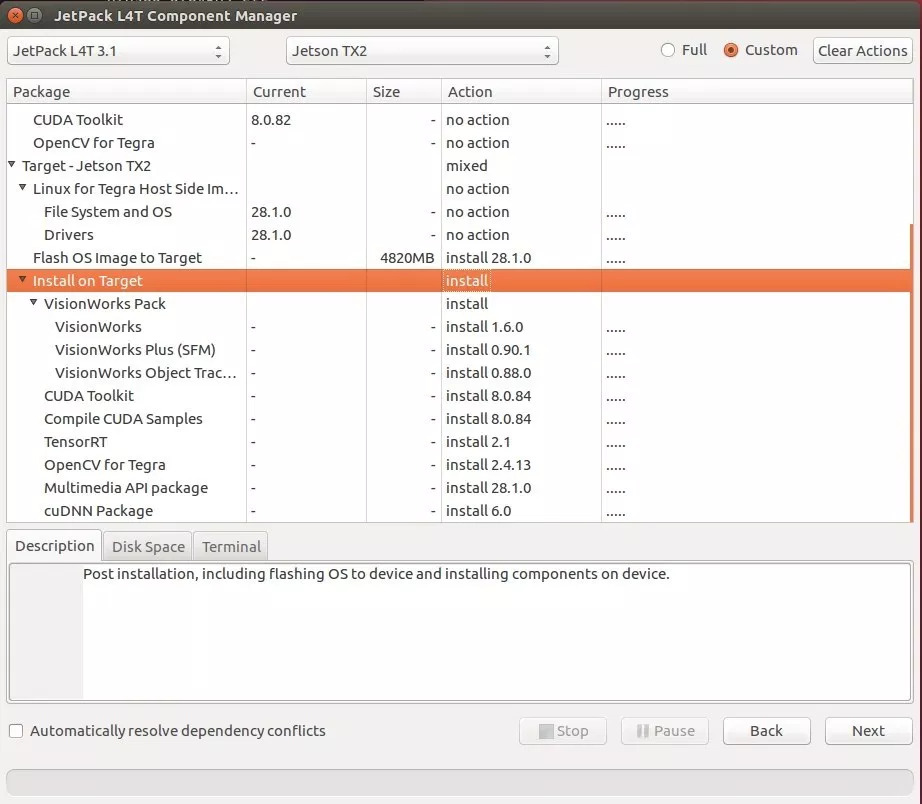

# Configurando o Development Kit Jetson TX2


Neste guia, faremos os setups iniciais na placa da Nvidia - Development Kit Jetson TX2

#  O que é preciso?

- Um Host PC com Linux 16.04
- Development Kit Jetson TX2
- Mouse/Teclado
- Monitor
- Roteador/Cabos de rede


# Configurando o Host PC 

- Conecte o seu Computador a uma rede local 
- Em seu computador, rodando um Linux 16.04 faça o [download do JetPack 3.2.1](https://developer.nvidia.com/embedded/jetpack-3_2_1)
- Abra o terminal e crie uma pasta no seu diretório
```
mkdir ~/jtx2
```
Mova o JetPack 3.2.1 para dentro da pasta criada

```
mv ~/Downloads/JetPack-L4T-3.2.1-linux-x64_b23.run  ~/jtx2

```
Garanta que o JetPack tem permissão para executar 

```
 chmod +x JetPack-L4T-3.2.1-linux-x64_b23.run 

```

Execute o JetPack 3.2.1

```
./JetPack-L4T-3.2.1-linux-x64_b23.run 

```

Clique em Next
 

Configure corretamente o diretório para instalação
 

Selecione a placa Jetson TX2
 

Escolha aqui o que será instalado na sua J120
 

Next para seguir a instalção
 

Selecione Finish
 


 


# Vamos conlocar a Jetson TX2 em modo de programção!

Conecte a fonte de alimentação na sua placa

 


Para entrar em modo de programação, aperte e solte o botão Power, depois segure o botão Recovery ao mesmo tempo em que segura o botão de Reset por dois segundos, logo após, solte o botão de Reset, e, por ultimo, solte o botão de Recovery. 


Para verificar se a placa está em modo de programação, digite o comando num terminal

```
lsusb

```


Conecte o cabo HDMI, o cabo micro usb e o cabo de rede na sua JetsonTX2 e no seu Pc 


Dê Enter neste terminal quando a Jetson TX2 estiver em modo de programação
 

Aguarde o Host Pc terminar a instalação e reinicie o sistema para validar as configurações


## Tutorial baseado no [JetPack 3.0 – NVIDIA Jetson TX2 Development Kit](https://www.jetsonhacks.com/2017/03/21/jetpack-3-0-nvidia-jetson-tx2-development-kit/) 


